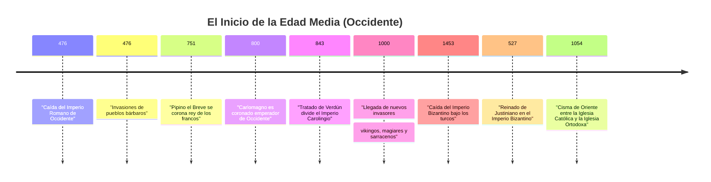
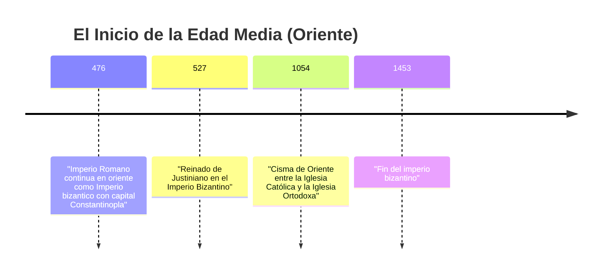

#1. Linea del tiempo de los acontecimientos más relevantes

```mermaid
timeline
    title El Inicio de la Edad Media (Occidente)
    476 : "Caída del Imperio Romano de Occidente"
    476 : "Invasiones de pueblos bárbaros"
    751 : "Pipino el Breve se corona rey de los francos"
    800 : "Carlomagno es coronado emperador de Occidente"
    843 : "Tratado de Verdún divide el Imperio Carolingio"
    1000 : "Llegada de nuevos invasores: vikingos, magiares y sarracenos"
    1453 : "Caída del Imperio Bizantino bajo los turcos"
    527 : "Reinado de Justiniano en el Imperio Bizantino"
    1054 : "Cisma de Oriente entre la Iglesia Católica y la Iglesia Ortodoxa"
```

```mermaid
timeline
    title El Inicio de la Edad Media (Oriente)
    476 : "Imperio Romano continua en oriente como Imperio bizantico con capital Constantinopla"
    527 : "Reinado de Justiniano en el Imperio Bizantino"
    1054 : "Cisma de Oriente entre la Iglesia Católica y la Iglesia Ortodoxa"
    1453 : "Fin del imperio bizantino"
```
